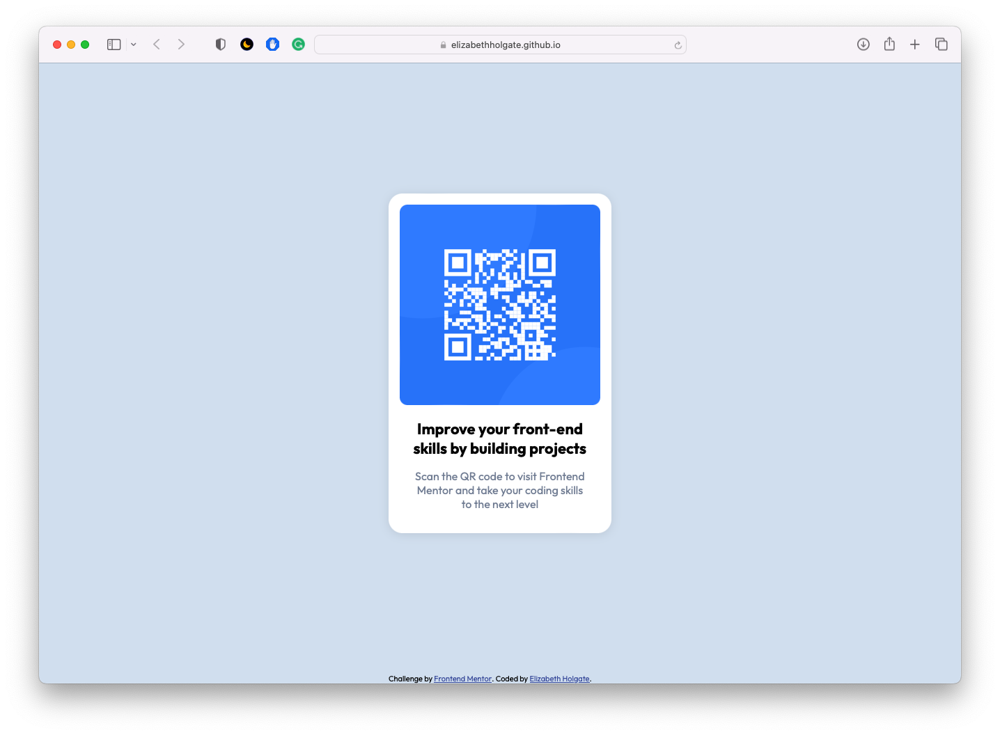

# Frontend Mentor - QR code component solution

This is a solution to the [QR code component challenge on Frontend Mentor](https://www.frontendmentor.io/challenges/qr-code-component-iux_sIO_H). Frontend Mentor challenges help you improve your coding skills by building realistic projects. 

## Table of contents

- [Overview](#overview)
  - [Screenshot](#screenshot)
  - [Links](#links)
- [My process](#my-process)
  - [Built with](#built-with)
  - [What I learned](#what-i-learned)
  - [Useful resources](#useful-resources)
- [Author](#author)

## Overview

### Screenshot

### Links

- Solution URL: [Add solution URL here](https://github.com/ElizabethHolgate/qr-code-component-main)
- Live Site URL: [Add live site URL here](https://elizabethholgate.github.io/qr-code-component-main/)

## My process

### Built with

- Semantic HTML5 markup
- CSS custom properties

### What I learned

I learned about CSS variables and tried them out for the first time! 

All my previous projects were based on my own design so it didn't matter if they didn't look exactly right. I enjoyed the challenge of coding a component to look as much like the design as possible.

### Useful resources

- [Kevin Powell](https://www.youtube.com/@KevinPowell) - Kevin Powell's series on CSS variables helped me understand what they are and how to use them.
- [nekoCalc](https://nekocalc.com/px-to-rem-converter) - This helped me gain a better understanding of REM by converting PX (a unit I'm more familiar with) to REM.

## Author

- GitHub - [@ElizabethHolgate](https://github.com/ElizabethHolgate)
- Frontend Mentor - [@ElizabethHolgate](https://www.frontendmentor.io/profile/ElizabethHolgate)
